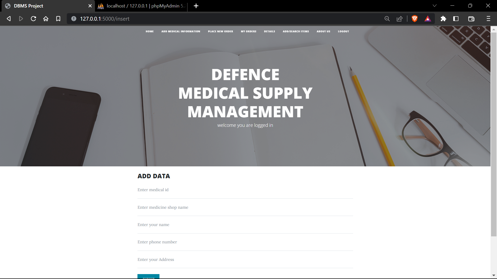
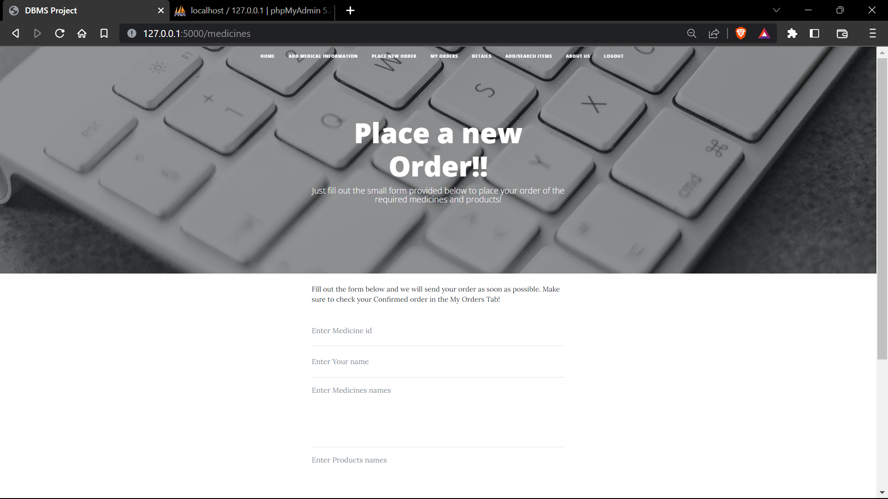
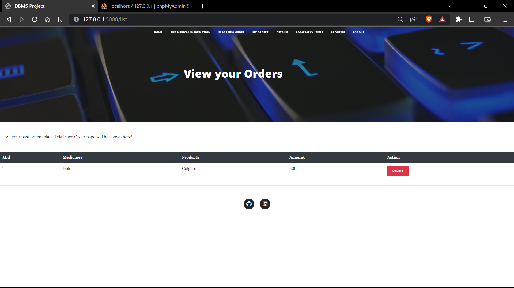
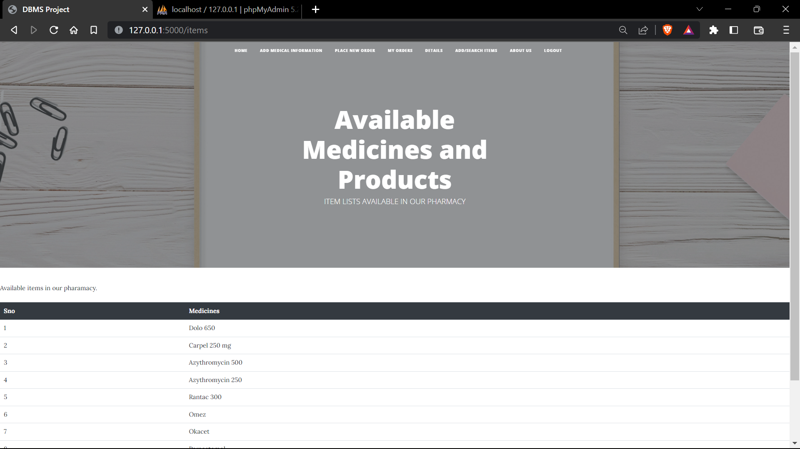
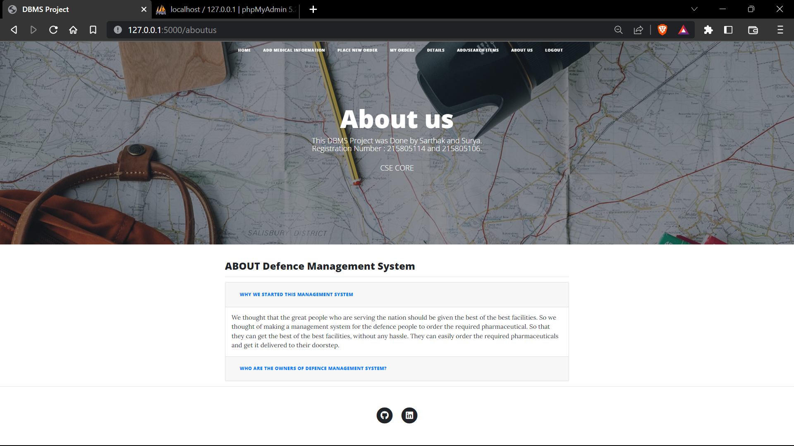
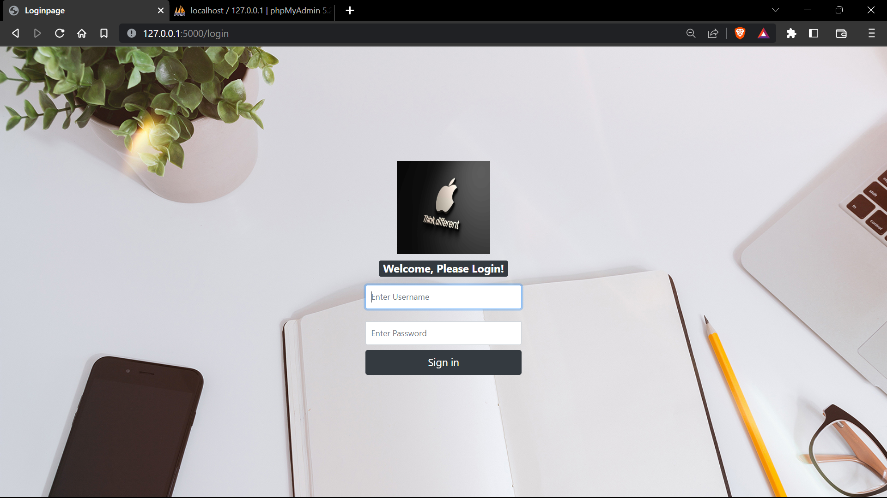

# Medicine_Management 

# Project Details :-

* **Name** - Working of a Website used for Management of Medicines  
* **FrontEnd Language Used** - Bootstrap HTML, CSS, JavaScript. 
* **BackEnd Language Used** -  Python (Flask), SQLAlchemy. 
* **Software Used** - XAMPP, PHP
* **Author** - Surya Kiran and Sarthak Jaryal.

# Description and Features :- 

This Repository contains a Project of Working of a Pharmaceutical Website With Real Time User-Interface. In this mini project, we have tried to make a Real time website  which will interact with user and collect Login Details, The application will then check the Credentials present in the [Json File](config.json "Jump to the Json File"),  and if the Credentials match with the ones in the file, then The Login will be Successful else, it will fail. After Successful login, the user can perform numerous actions such as Adding the details about the person, Modifying/Deleting the details about the person, Place a new order of medicines just by filling out a simple form, View Orders History, in the "My Orders" Tab, See the medicines and products currently available at the pharmacy, Add more medicines, Search if any medicine is present or not, After work, user can log out of the account. 

This working model runs on XAMPP local host server. 

* To access the Driver class (main python file) head over to [this](main.py "Redirects you to python file") path. 

# Major Snapshots :- 
# Home Page, After Login :-  

# Capable Operations :- 
* Add Details of the personel :
 

* Place a New Order of Medicine :
 

* My Orders :
 

* Available Medicine List :
 

* About the Creators :
 

# Login Page :- 

* For Detailed Snapshots of each Operations, with respective corner case, check out [output_snapshots](output_snapshots/) folder. 

# Note :- 
This XAMPP based application will only work if your computer has Python and XAMPP installed.

Download XAMPP from [here](https://www.apachefriends.org/download.html).
 
Open command prompt and install the following :
1. pip install flask
2. pip install Flask-SQLAlchemy
3. pip install mysqlclient
4. pip install Flask-Login

# Socials :- 

Link                                                                        |
----------------------------------------------------------------------------|
[HackerRank](https://www.hackerrank.com/Surya_15 "My HackerRank Profile")|
[LinkedIn](https://www.linkedin.com/in/surya-kiran-3430b525b/ "My LinkedIn page")    |
[Instagram](https://www.instagram.com/suryaa.kiran/ "My Insta Page, Just in case you wanna follow :p")             |

Thank You  <3 

